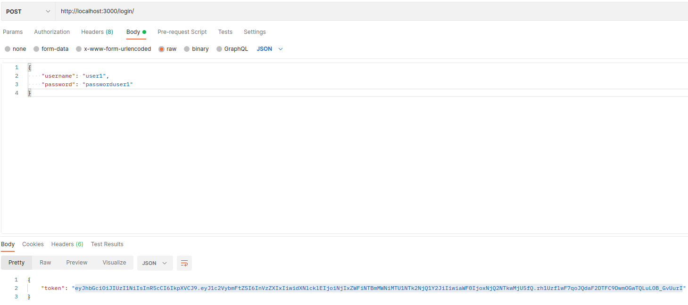

# Using Vault autentication
### Architecture of this project

Middelware <> Router <> Service <> Model <> BD

### SETING ENVOIRMENT 

Here we have an example of .env, for use mongoDB on local we need to define MONGODB_ENV=PRE and for use MONGO DB ATLAS we need to define on .env MONGODB_ENV=PRO

~~~
MONGODB_USER=
MONGODB_PASSWORD=
MONGODB_HOST=
MONGODB_PORT=
MONGODB_DATABASE=
MONGODB_ENV=

JWT_SECRET=
~~~

### Configuring MongoDB with Docker
We will use the docker compose for build this image docker.

First step we will create the file *docker-compose.yml*

~~~~
version: '3.1'

services:

  mongo:
    image: mongo:4.2
    restart: always
    ports:
      - 27017:27017
    environment:
      MONGO_INITDB_ROOT_USERNAME: root
      MONGO_INITDB_ROOT_PASSWORD: admin
~~~~

After this we will start the container with docker-compose, the option -d is for put the container output in the background

~~~
docker-compose up -d
~~~

For knew if the docker container is runing we will do and give the **CONTAINER ID**

~~~
docker ps
~~~

When we run a container with mongo, docker automatically assign a ip addres to this container. We will use docker inspect for know the IP.

~~~~
docker inspect CONTAINER_ID | grep "IPAddress"
~~~~

When we know the IP Adress we will connect with a [mongosh](https://docs.mongodb.com/mongodb-shell/)

If we want to see the databases of MongoDB we need to autenticate with user that we put in *docker-compose.yml*
For [connect with mongosh](https://docs.mongodb.com/mongodb-shell/connect/#std-label-mdb-shell-connect) we need the docker container IP address

~~~~
mongosh "mongodb://<docker container ip>" --username <user admin> --password <password>
~~~~

After this we will do a show dbs, and we will see the 3 default databases.

~~~
show dbs
~~~

### Creating database user
Autenticated with mongoosh we will create a database users
~~~
use users
~~~

We need to stay connected with mongosh into a mongoDB. We will execute this command for create a user for this database

~~~~
db.createUser({ user: "superadmin", pwd: "superadmin", roles: [{ role: "readWrite", db: "users" }] })
~~~~

After this we will connect with this new user
~~~~
mongosh "mongodb://<docker container ip>" --username <user admin> --password <password> --authenticationDatabase users
~~~~

### Envoirment variables

We need to create a .env file, into this file we will put the configurations for connect to database

~~~~
MONGODB_USER= <user database>
MONGODB_PASSWORD= <password of user database>
MONGODB_HOST= <ip of the hosts that contains the container>
MONGODB_PORT= <port of mongodb>
MONGODB_DATABASE= <database>
~~~~

For collect variable envoirment from .env file
~~~
yarn add dotenv
~~~

### Instaling Moongose ORM

For connect with Mongo DataBase we will use ORM Moongose,  first we need to add moongose to Node JS Project

~~~
yarn add mongoose
~~~

## Using Express Api
First we need to start our express aplication, we will use the command 

~~~
yarn start
~~~

# Testing API

First for test this some features api we need to have token authentication,

### Login

If we want to take the Login token, we will post into body request, the username, and password, the login will return a token for authenticate

### Authentication

If we want to, post,get or delete a user we need to use the token for authenticate, in all requests we need to put the token.

### Post User

We will Post into url api with a JSON, we will use the Postman , we will go to POST action in Postman, and after we go to body request, we will select JSON type text.

~~~
{

"username": "user1",

"password": "passworduser1"

}
~~~

After we need to connect to BD users and see if the users is created

~~~~
mongosh "mongodb://<docker container ip>" --username superadmin --password superadmin --authenticationDatabase users
~~~~

~~~
use m03
~~~
~~~
db.users.find({})
~~~

### Get User
For get a specific user we will put on browser 

~~~
http://localhost:3000/<username>
~~~

### Delete User

For delete a user we will use DELETE request from postman, we will put the URL and a username of the user that we want to delete

### Get all Users
For get the all users, we will put this command

~~~
http://localhost:3000/users
~~~